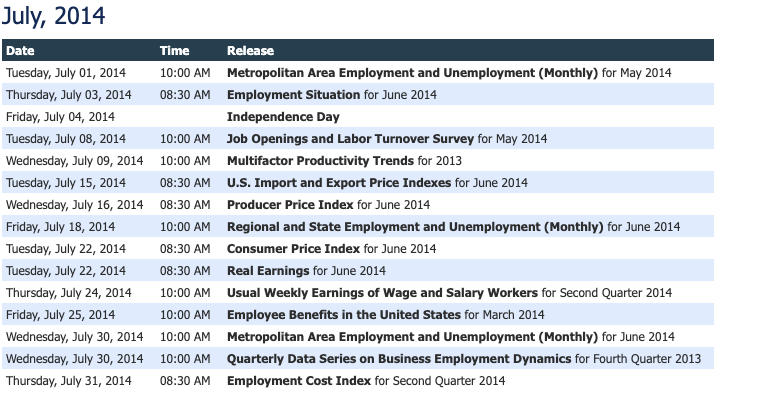

Model introspection; data linneage; white boxing models; he calls it 'introspecting'; lime, dalex; 

```{r setup, include = FALSE, message = FALSE, warning = FALSE}
library(tidyverse)
library(riingo)
library(almanac)
library(slide)

knitr::opts_chunk$set(message=FALSE, warning=FALSE, comment= NA)
```

Let's choose a few tickers and sector labels.

```{r}

etf_ticker_sector <- tibble(
  ticker = c("XLY", "XLP", "XLE",	
          "XLF", "XLV",	"XLI", "XLB", 
          "XLK", "XLU", "XLRE", 
          "SPY"),	
  sector = c("Consumer Discretionary", "Consumer Staples", "Energy", 
          "Financials", "Health Care", "Industrials", "Materials", 
          "Information Technology", "Utilities", "Real Estate",
          "Market")
)

etf_ticker_sector
```


Set our key for use this session with:

```{r, include=FALSE}

# Need an API key for tiingo

riingo_set_token("97d26898fe27141ef524c1fa3ab0d3f0c3c59b09")
```

```{r, eval = FALSE}

# Need an API key for tiingo

riingo_set_token("your API key here")
```

Import prices from `tiingo`.


```{r}
etf_prices <-
  etf_ticker_sector %>%
  pull(ticker) %>% 
  riingo_prices(., 
                start_date = "2010-01-01",
                end_date = Sys.Date()) %>% 
  mutate(date = ymd(date))

etf_prices %>% 
  group_by(ticker) %>% 
  slice(1:3)
```

Let's calculate rolling 50-day and 200-day average for SPY using `slide_double()` in combination with `mutate()`. 

```{r}
etf_prices %>% 
  group_by(ticker) %>% 
  filter(ticker == "SPY") %>% 
  mutate(sma_50 = slide_dbl(close, mean, .before = 50, .complete = TRUE),
         sma_200 = slide_dbl(close, mean, .before = 200, .complete = TRUE)) %>% 
  select(date, sma_50, sma_200)
```

We should see NAs in the first 50 rows of `sma_50` and the first 200 rows of `sma_200`.

Let's plot. 

```{r}
rolling_average_plot <- 
etf_prices %>% 
  group_by(ticker) %>% 
  filter(ticker == "SPY") %>% 
  mutate(sma_50 = slide_dbl(close, mean, .before = 50, .complete = TRUE),
         sma_200 = slide_dbl(close, mean, .before = 200, .complete = TRUE)) %>% 
  select(date, close, sma_50, sma_200) %>% 
  ggplot(aes(x = date)) + 
  geom_line(aes(y = close), color = "purple", linetype = "dotted") +
  geom_line(aes(y = sma_50), color = "cornflowerblue", linetype = "solid") + 
  geom_line(aes(y = sma_200), color = "green", linetype = "solid") +
  scale_x_date(breaks = scales::pretty_breaks(n = 10)) +
  theme_minimal()

rolling_average_plot
```

How have volumes behaved throughout this time period?

```{r}
volume_plot <- 
etf_prices %>% 
  group_by(ticker) %>% 
  filter(ticker == "SPY") %>% 
 # mutate(sma_50 = slide_dbl(close, mean, .before = 50, .complete = TRUE)) 
  ggplot(aes(x = date)) + 
  geom_col(aes(y = volume), color = "pink", alpha = .5) +
  scale_x_date(breaks = scales::pretty_breaks(n = 10)) +
  theme_minimal() +
  theme(plot.title = element_text(hjust = .5)) +
  labs(y = "volume")
```

I'm curious if BLS reports or holidays affect volumes and want to add a flag to the charts on the day of BLS reports and the day *after* any market holidays...Let's use `almanac` in a way that Davis never intended (my favorite way to use packages).


The BLS reports jobs numbers on the first friday of each month.

Let's use `alamanac` to create a data frame of the first Fridays of each month since 2010.

```{r}
monthly(since = "2010-01-02") %>%
  recur_on_interval(1) %>%
  recur_on_wday("Friday", nth = 1) %>% 
  sch_seq("2010-01-01", "2020-03-01", .) %>% 
  tibble(nfp_release_dates = .,
         bls_flag = 1)

```

Any July 4th in there? 

Yes, in 2014! 



Let's us `calendar_usa_federal` make sure we don't hit any other holidays. Since the BLS targets a Friday, we can shift backwards by one day to Thursday.

```{r}
on_us_holidays <- calendar_usa_federal()

monthly(since = "2010-01-10") %>%
  recur_on_interval(1) %>%
  recur_on_wday("Friday", nth = 1) %>% 
  sch_seq("2010-01-01", "2020-03-01", .) %>% 
  sch_adjust(on_us_holidays, adjustment = -1) %>% 
  wday(label = T)
```

```{r}
bls_reports <- 
monthly(since = "2010-01-10") %>%
  recur_on_interval(1) %>%
  recur_on_wday("Friday", nth = 1) %>% 
  sch_seq("2010-01-01", "2020-03-01", .) %>% 
  sch_adjust(on_us_holidays, adjustment = -1)
  tibble(nfp_release_dates = .,
         bls_flag = 1)
```

I also want to investigate volume on the day after a market holiday. I'll just the usa federal holidays as a proxy for now. I want to shift out one day but again I need to make sure I don't land on a weekend. Let's use a combination of `sch_seq()` and `sch_jump()` for this.

```{r}
on_us_holidays <- calendar_usa_federal()
on_weekends <- weekly(since = "2010-01-01") %>% 
  recur_on_weekends()

post_holiday <- 
sch_seq("2010-01-01", "2019-10-01", on_us_holidays)  %>% 
sch_jump(days(1), on_weekends)

day_after <- 
tibble(
  post_holiday = post_holiday,
  holiday_flag = .3
)

```

Now we can add those date flags to our etf data

```{r}
etf_prices_date_flags <- 
etf_prices %>% 
  group_by(ticker) %>% 
  mutate(sma_50 = slide_dbl(close, mean, .before = 50, .complete = TRUE),
         sma_200 = slide_dbl(close, mean, .before = 200, .complete = TRUE)) %>% 
  select(date, close, volume, sma_50, sma_200) %>% 
  left_join(bls_reports, by = c("date" = "nfp_release_dates")) %>% 
  left_join(day_after, by = c("date" = "post_holiday")) 

```

Let's save that object for use in the Shiny app later.

```{r}
write_rds(etf_prices_date_flags, "etf_prices_date_flags.RDS")
```

Here's a plot with volume bars and flags for the holidays and BLS reports, Halloween theme.

```{r}

etf_prices_date_flags %>% 
  filter(ticker ==  "SPY") %>% 
  ggplot(aes(x = date)) + 
  geom_col(aes(y = volume), color = "pink", alpha = .5) +
  geom_point(data = etf_prices_date_flags %>% filter(ticker == "SPY" & bls_flag == 1), aes(date, volume), color = "orange") +
  geom_point(data = etf_prices_date_flags %>% filter(ticker == "SPY" & holiday_flag == .3), aes(date, volume), color = "black") +
  scale_x_date(breaks = scales::pretty_breaks(n = 10)) +
  theme_minimal() +
  theme(plot.title = element_text(hjust = .5)) +
  labs(y = "volume")
```

```{r}
volume_plot_flags <-
etf_prices_date_flags %>% 
  filter(ticker ==  "SPY") %>% 
  ggplot(aes(x = date)) + 
  geom_col(aes(y = volume), color = "pink", alpha = .5) +
  geom_point(data = etf_prices_date_flags %>% filter(ticker == "SPY" & bls_flag == 1), aes(date, volume), color = "orange") +
  geom_point(data = etf_prices_date_flags %>% filter(ticker == "SPY" & holiday_flag == .3), aes(date, volume), color = "black") +
  scale_x_date(breaks = scales::pretty_breaks(n = 10)) +
  theme_minimal() +
  theme(plot.title = element_text(hjust = .5)) +
  labs(y = "volume")
```

Let's combine into one our rolling average chart and our volume with date flags chart. 

```{r}
subplot(rolling_average_plot, volume_plot_flags, nrows = 2, margin = 0.04, heights = c(0.6, 0.4), titleX = TRUE, titleY = TRUE)
```


### Rolling Regression Example

```{r}
rolling_regression <- function(.formula, 
                               ..., 
                               .before = 0L, 
                               .after = 0L, 
                               .complete = FALSE) {
  
  single_group_data <- tibble(...)
  
  slide_index(
    .x = single_group_data, 
    .i = single_group_data$date, 
    .f = ~lm(.formula, data = .x), 
    .before = .before,
    .after = .after,
    .complete = .complete
  )
}
  
etf_prices %>%
  group_by(ticker) %>%
  mutate(date = ymd(date)) %>% 
  filter(ticker == "SPY" | ticker == "XLY") %>% 
  mutate(
    regression = rolling_regression(
      open ~ close + volume, 
      date = date, 
      open = open,
      close = close,
      volume = volume,
      .before = 20,
      .complete = TRUE
    )
  )
```


